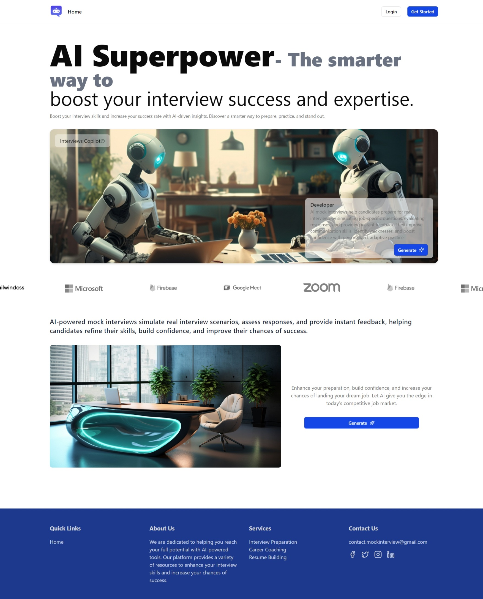

# AI Mock Interview

AI Mock Interview is an application that helps users practice interviews with artificial intelligence. The app uses AI to generate questions, evaluate responses, and provide feedback to improve interview skills.

## 🚀 Technologies Used
- **React**: Modern and smooth user interface development.
- **TypeScript**: Enhances code safety and maintainability.
- **Firebase**: Data storage, user authentication, and app deployment.
- **Clerk**: Authentication and user management.
- **ShadCN**: Beautiful, easy-to-use, and customizable UI components.

## 🛠 Setup and Run the Project

### Requirements
- Node.js >= 16
- pnpm

### Installation
```bash
# Clone repository
git clone https://github.com/vobaolong/ai-mock-interview.git
cd ai-mock-interview

# Install dependencies
pnpm install
```

### Run the Application
```bash
pnpm run dev
```

The application will run at `http://localhost:3000`.

## 📌 Key Features
- AI-powered mock interviews.
- Response evaluation and feedback.
- Supports multiple interview fields.
- User interview history storage.
- User-friendly and intuitive UI.

## 🔧 Environment Variables
The `.env` file should be created in the root directory with the following variables:

| Variable                         | Description                    |
|----------------------------------|--------------------------------|
| VITE_CLERK_PUBLISHABLE_KEY       | Your Clerk publishable key     |
| CLERK_SECRET_KEY                 | Your Clerk secret key          |
| VITE_FIREBASE_API_KEY            | Firebase API key               |
| VITE_FIREBASE_AUTH_DOMAIN        | Firebase auth domain           |
| VITE_FIREBASE_PROJECT_ID         | Firebase project ID            |
| VITE_FIREBASE_STORAGE_BUCKET     | Firebase storage bucket        |
| VITE_FIREBASE_MESSAGING_SENDER_ID| Firebase messaging sender ID   |
| VITE_FIREBASE_APP_ID             | Firebase app ID                |
| VITE_GEMINI_API_KEY              | Gemini API key                 |
| VITE_GEMINI_MODEL                | Gemini Model                   |

## 📄 Documentation
- [React Documentation](https://react.dev/)
- [TypeScript Documentation](https://www.typescriptlang.org/docs/)
- [Firebase Documentation](https://firebase.google.com/docs)
- [Clerk Documentation](https://clerk.com/docs)
- [ShadCN Documentation](https://ui.shadcn.com/)

## 📜 License
This project is licensed under the **MIT License**. Feel free to use and contribute.

## 🤝 Contributions
We welcome contributions from the community! If you have any ideas or find bugs, please create an issue or submit a pull request.

## 📞 Contact
If you have any questions, feel free to reach out via email: **work.vobaolong@gmail.com**

---

Thank you for using AI Mock Interview! 🚀


